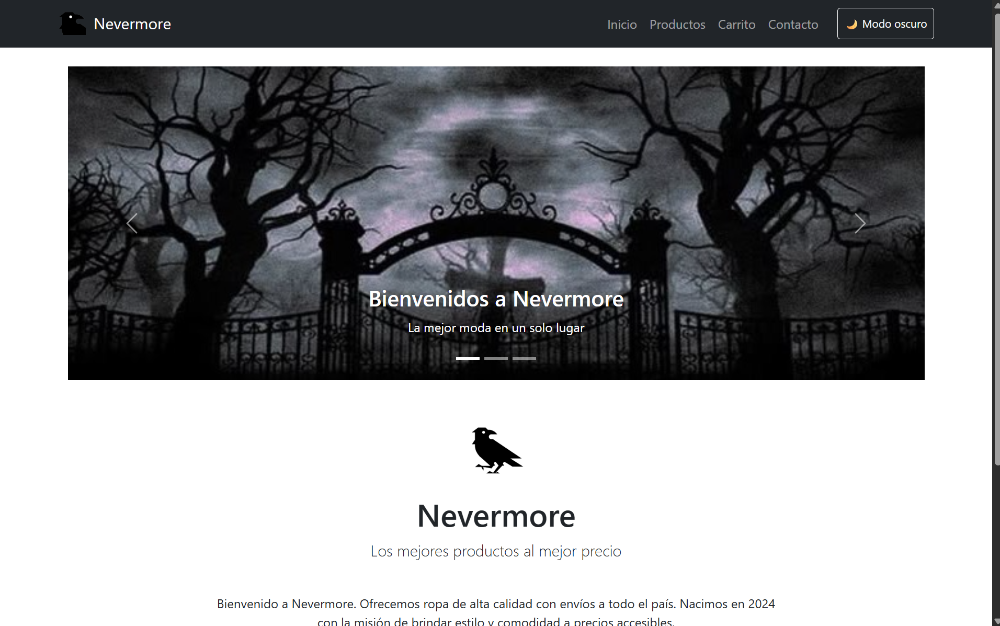
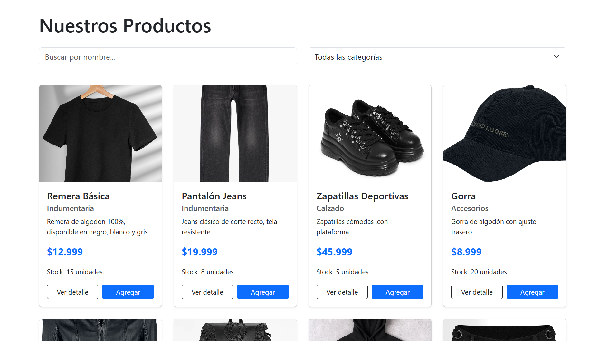
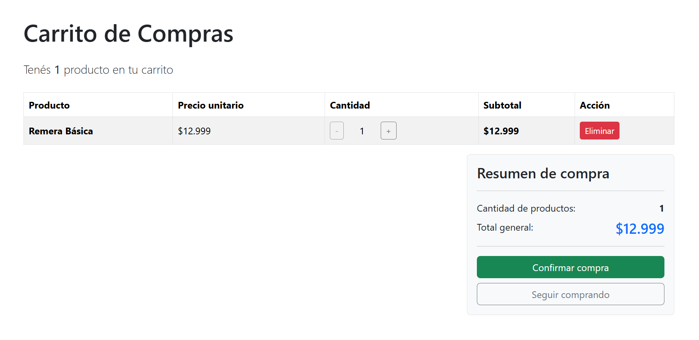
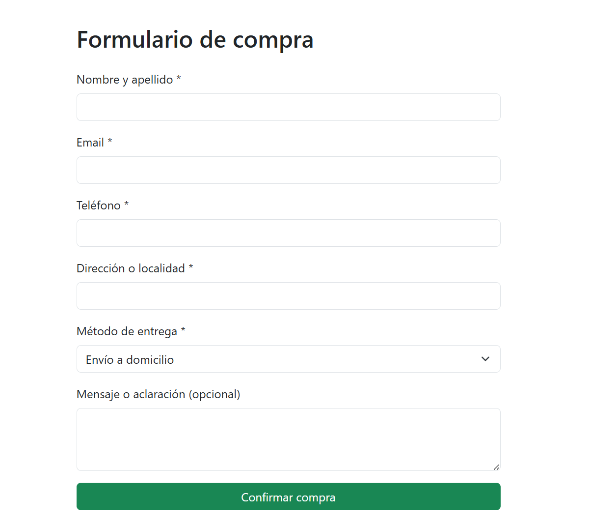

# Nevermore - Tienda online

Tienda online de indumentaria desarrollada como Trabajo Práctico de la materia **Construcción de Interfaces de Usuario**.

## Descripción del proyecto

Nevermore es una tienda online de ropa donde los usuarios pueden explorar un catálogo de productos, filtrarlos por nombre y categoría, ver el detalle de cada producto, armar un carrito de compras y completar una compra simulada mediante un formulario de contacto con validaciones.

## Tecnologías utilizadas

- **React** (componentes funcionales + hooks: `useState`, `useEffect`)
- **React Router DOM** (navegación entre páginas y rutas dinámicas)
- **React Bootstrap** (componentes UI y diseño responsive)
- **Vite** (entorno de desarrollo y build)
- **localStorage** (persistencia del carrito y del tema claro/oscuro)

## Funcionalidades

- Página de inicio con banner, logo y descripción de la tienda
- Catálogo de productos con búsqueda por nombre y filtro por categoría
- Vista de detalle de cada producto (ruta dinámica `/producto/:id`)
- Carrito de compras: agregar, aumentar/disminuir cantidad, eliminar productos, cálculo de subtotales y total
- Formulario de compra con validaciones (campos obligatorios, formato de email, carrito no vacío)
- Modo claro / oscuro con persistencia
- Persistencia del carrito
- Diseño responsive (mobile, tablet y escritorio)

## Instalación y ejecución

1. Cloná el repositorio:
   ```bash
   git clone https://github.com/agustina505/Tienda-react.git
   ```
2. Entrá a la carpeta del proyecto:
   ```bash
   cd Tienda-react
   ```
3. Instalá las dependencias:
   ```bash
   npm install
   ```
4. Iniciá el servidor de desarrollo:
   ```bash
   npm run dev
   ```
5. Abrí el navegador en la URL que indique la consola (por defecto `http://localhost:5173`).

## Integrantes del grupo

- Fontivero Agustina

## Link al repositorio

[https://github.com/agustina505/Tienda-react](https://github.com/agustina505/Tienda-react)

# Capturas del sitio

## Inicio


## Productos



## Carrito



## Formulario de contacto

